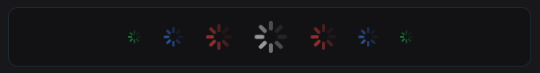

<p align="center">

</p>

# Shadcn Spinner

A lightweight, customizable loading spinner component designed for **shadcn/ui** projects.

Inspired by [Radix UI](https://radix-ui.com/) design principles. Built for the [shadcn/ui](https://ui.shadcn.com/) ecosystem.

**🎯 Try it live:** https://shadcn-spinner.vercel.app

## ✨ Features

- **Highly customizable** - Size variants, custom colors, and styling
- **Lightweight** - Zero dependencies beyond React
- **shadcn/ui compatible** - Follows shadcn patterns and conventions
- **Easy integration** - Add via shadcn CLI or direct import
- **Theme aware** - Works with light/dark themes
- **Accessible** - Proper ARIA labels and screen reader support

## 🚀 Quick Start

### Method 1: shadcn CLI (Recommended)

Add the spinner component directly to your shadcn project:

```bash
npx shadcn add https://shadcn-spinner.vercel.app/api/r/spinner
```

### Method 2: Curl Installation

Copy the spinner component to your project:

```bash
curl -o components/ui/spinner.tsx https://shadcn-spinner.vercel.app/api/r/spinner.json
```

### Method 3: Manual Installation

Grab the spinner component directly from this repo:

```bash
cp lib/spinner.tsx your-project/components/ui/spinner.tsx
```

## 📖 Usage

```tsx
import { Spinner } from "@/components/ui/spinner"

// Basic usage
<Spinner />

// With size variants
<Spinner size="sm" />
<Spinner size="lg" />

// Custom styling
<Spinner className="text-blue-500" />
<Spinner size="sm" className="bg-black dark:bg-white" />

// In loading states
{isLoading ? <Spinner size="sm" /> : <YourContent />}
```

### Size Variants

| Size      | Class     | Dimensions  |
| --------- | --------- | ----------- |
| `sm`      | `h-4 w-4` | 16px × 16px |
| `default` | `h-6 w-6` | 24px × 24px |
| `lg`      | `h-8 w-8` | 32px × 32px |

## 🏗️ Development

This repository uses a clean **lib + site** structure:

```
shadcn-spinner/
├── lib/
│   └── spinner.tsx          # Core component
├── site/                    # Website (shadcn-spinner.vercel.app)
│   ├── src/app/
│   └── components/
├── scripts/
│   └── build-registry.js    # Script to build registry files for shadcn
└── README.md
```

### Local Development

```bash
# Install dependencies
pnpm install

# Start the site
pnpm dev

# Test building the registry files for shadcn
# (note: these files aren't committed as they are generated during deployment!)
pnpm build
```

## 🙏 Credits

- Built by [@allipiopereira](https://github.com/allipiopereira) 🚀
- Rebuilt for Tailwind v4 with vercel and shadcn registry support by [@lujstn](https://github.com/lujstn) ⚡️
- Thanks to [@BramSuurdje](https://github.com/BramSuurdje) for building the shadcn CLI integration! 💯

## 📄 License

MIT License - feel free to use in your projects!
